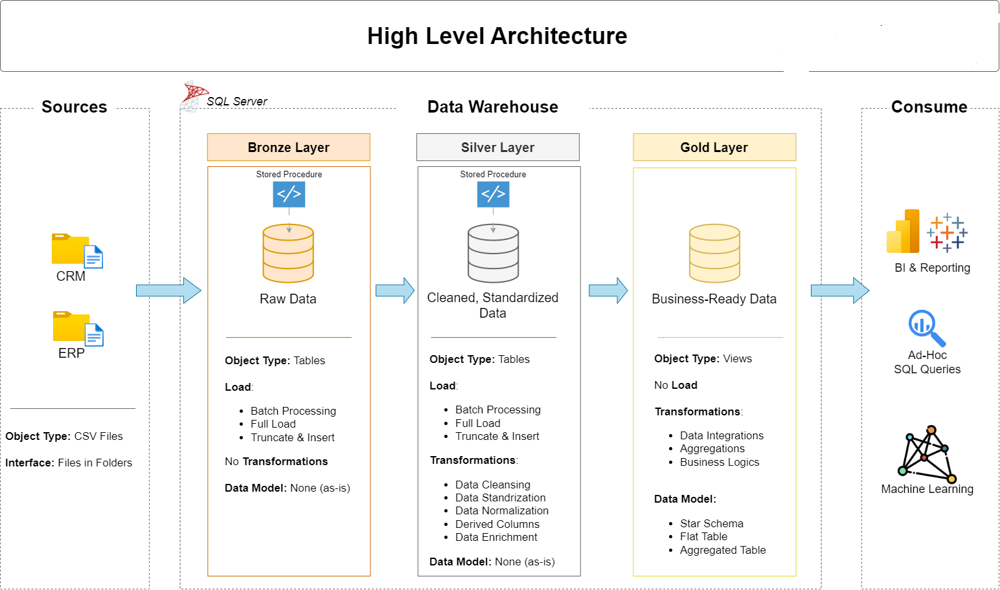
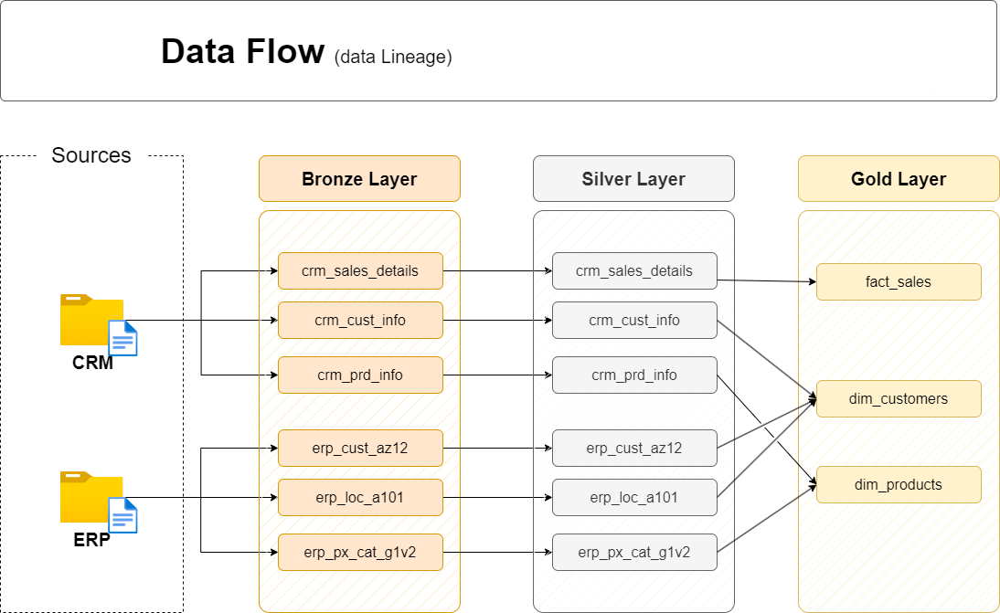
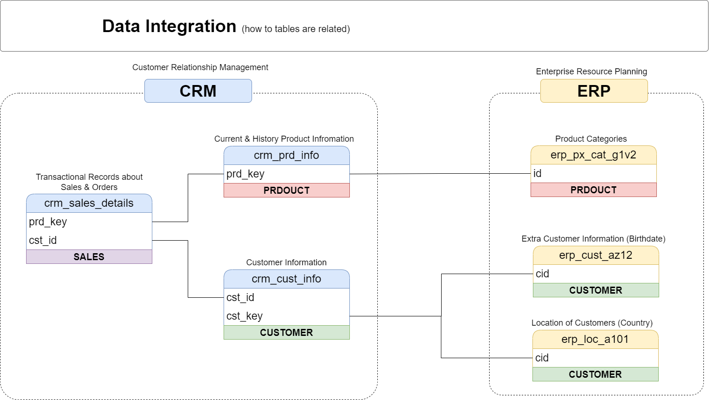
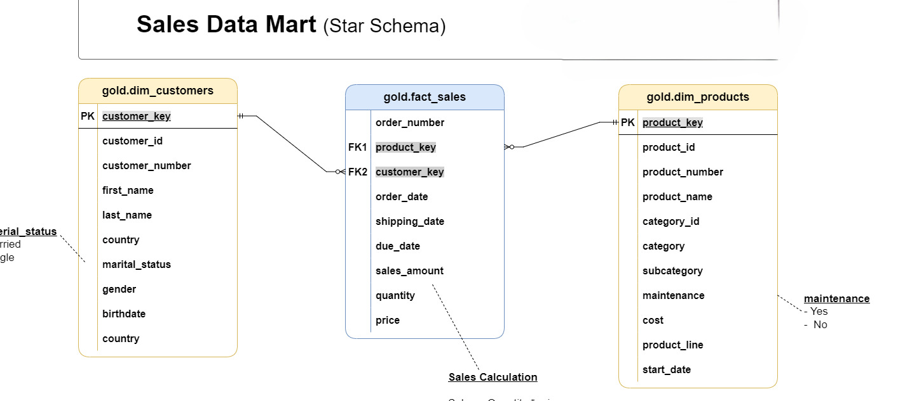

# 🚀 Enterprise SQL Data Warehouse & Analytics Platform

[](https://www.microsoft.com/en-us/sql-server/)
[](#)
[](#)

Welcome to the **Enterprise SQL Data Warehouse and Analytics Project** repository! 📊

This portfolio project demonstrates a complete, end-to-end data engineering and business intelligence solution. It showcases the extraction of raw data from multiple source systems (CRM and ERP), the orchestration of a robust ETL pipeline, and the creation of a structured data warehouse optimized for high-performance analytics.

---

## 🏗️ 1. High-Level Data Architecture

The backbone of this project is built upon the widely adopted **Medallion Architecture** (Bronze, Silver, and Gold layers). This multi-layered approach ensures data quality, repeatability, and scalability.



* **Bronze Layer (Raw Data)**: Acts as the landing zone. Data is ingested from flat CSV files into the SQL Server Database exactly as it appears in the source systems.
* **Silver Layer (Cleansed Data)**: The transformation engine. Data is cleaned, standardized, normalized, and enriched. Data quality issues (like missing values or formatting inconsistencies) are resolved here.
* **Gold Layer (Business-Ready Data)**: The presentation layer. Data is modeled into a Star Schema (Fact and Dimension tables), making it fully optimized for BI tools and ad-hoc analytical queries.

---

## ⚙️ 2. ETL Methodology & Data Flow

Building the warehouse required a comprehensive approach to **Extract, Transform, and Load (ETL)** operations, ensuring data integrity at every step.

### ETL Concepts & Transformation Rules
Standard data cleansing, normalization, and business logic were applied according to this ETL methodology:


### Data Lineage & Flow
To ensure total transparency, the data lineage tracks exactly how tables move and transform from the Bronze landing zone, through the Silver cleansing layer, and into the final Gold dimensional models.



---

## 🔗 3. Data Integration & Modeling

A critical challenge in data warehousing is merging disparate systems. This project successfully integrates transactional sales data from a **CRM** with product and customer demographic data from an **ERP**.

### Source System Integration
Here is how the distinct CRM and ERP entities map to one another to create a unified view of the business:



### The Final Data Model (Star Schema)
The Gold layer houses the final output: a highly efficient **Star Schema** Data Mart designed for analytical workloads. It features a central Fact table surrounded by descriptive Dimension tables.



---

## 📈 4. Business Intelligence & Analytics

With the Gold layer established, the data is ready to be consumed by BI tools to generate actionable insights. The analytics focus on three core business areas:

1. **Executive Sales Performance:** Tracking overall revenue, profitability, and high-level trends over time.
2. **Customer Segmentation:** Analyzing demographics (age, gender, location) to uncover who the most profitable customers are.
3. **Supply Chain Efficiency:** Monitoring operational metrics like average shipping times and delayed orders.

---

## 🛠️ 5. Important Links & Tools

* **[📝 Full Project Workspace (Notion)](https://www.notion.so/SQL-Data-Warehouse-Project-aa39d55cdba783a1b9ba01cf4b6cc5b2?source=copy_link):** Access my complete project phases, task tracking, and detailed notes.
* **Relational Database:** Microsoft SQL Server Express
* **Database Management:** SQL Server Management Studio (SSMS)
* **Architecture & Diagramming:** Draw.io

---

## 📂 6. Repository Structure

```text
sql-data-warehouse-project/
│
├── datasets/                 # Raw datasets used for the project (ERP and CRM CSV files)
│
├── Docs/                     # Project documentation and architectural diagrams
│   ├── data_architecture.png # Medallion architecture diagram
│   ├── data_catalog.md       # Catalog of datasets and field descriptions
│   ├── data_flow.png         # Data lineage diagram
│   ├── data_integration.png  # CRM and ERP entity mapping
│   ├── data_model.png        # Final Star Schema diagram
│   └── ETL.jpg               # ETL methodology mind map
│
├── scripts/                  # SQL scripts for ETL and transformations
│   ├── bronze/               # DDL and ingestion procedures for raw data
│   ├── silver/               # Cleansing, standardizing, and IF EXISTS drop logic
│   └── gold/                 # Views and modeling scripts for the Star Schema
│
├── tests/                    # Data quality and validation queries
│
├── LICENSE                   # License information for the repository
└── README.md                 # Project overview and instructions
